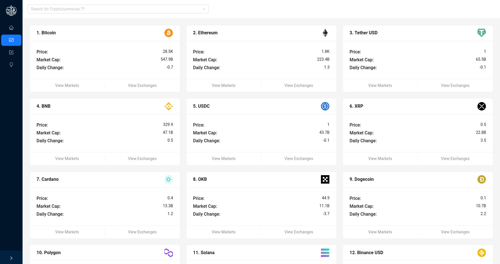
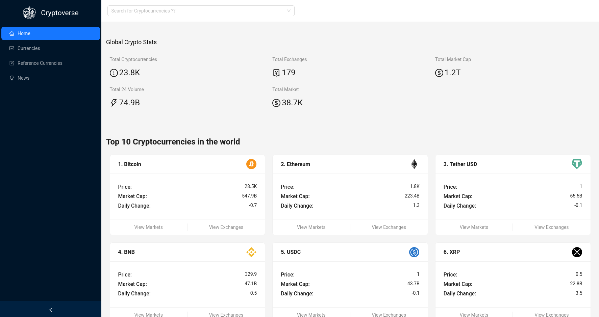

# Cryptoverse - Explore the World of Cryptocurrency

Cryptocurrency App powered by RapidAPI

for [live demo](https://cryptoverse-in-react.vercel.app/)

## Screenshots




## Pages

| Route                   | page                 |
| ----------------------- | -------------------- |
| `/`                     | Homepage             |
| `*`                     | 404 Page             |
| `/currencies`           | Currencies           |
| `/news`                 | News                 |
| `/exchange/:coinId`     | Exchange             |
| `/market/:coinId`       | Market               |
| `/crypto/:coinId`       | Crypto Details       |
| `/reference-currencies` | Reference Currencies |

## Features

- Written in TypeScript with predictable static types.
- Refactor Redux to use Redux Toolkit Query -> you've already learned how that works 👍
- Use Ant Design properly - tailwindcss, there should be minimal need for any custom CSS.
- Replace the react-icons package and instead use @ant-design/icons
- Fully responsive with Modern Design
- Designed with progressive enhancement in mind.
- Using types into single file `react-app.env.d.ts`
- Empower page title adn description with `react-helmet`
- Using redux as state management
- Format numbers with `millify`
- Format dates with `dayjs`

## Used tools

- `@ant-design/icons`
- `@reduxjs/toolkit`
- `antd`
- `axios`
- `chart.js`
- `dayjs`
- `millify`
- `react-helmet`
- `react-router-dom`
- `react-redux`
- `react`
- `tailwindcss`
- `typescript`

## Quick start 🚀

### First Step

```shell
git clone https://github.com/Mohammed-Taysser/cryptoverse.git
```

### Second Step

Inside cryptoverse Directory Install Dependencies By

```shell
npm install
```

### Last Step

Start The Development Server

```shell
npm start
```

## Contribution handshake🤝

- Fork it!
- Create your feature branch: `git checkout -b feature-name`
- Commit your changes: `git commit -am 'Some commit message'`
- Push to the branch: `git push origin feature-name`
- Submit a pull request winkwink😉

## License 📜

MIT © [`Mohammed Taysser`](https://github.com/mohammed-Taysser/)

## Resources & Inspiration

- <https://github.com/adrianhajdin/project_cryptoverse>
- <https://www.youtube.com/watch?v=9DDX3US3kss&t=4s>
- <https://rapidapi.com/Coinranking/api/coinranking1>
- <https://rapidapi.com/microsoft-azure-org-microsoft-cognitive-services/api/bing-news-search1>
- <https://gist.github.com/adrianhajdin/1008c664fe7896b316f5efbff8d97935>

## TODO

- [ ] Coin-details page : get news depend on the coin (request depend on response)
